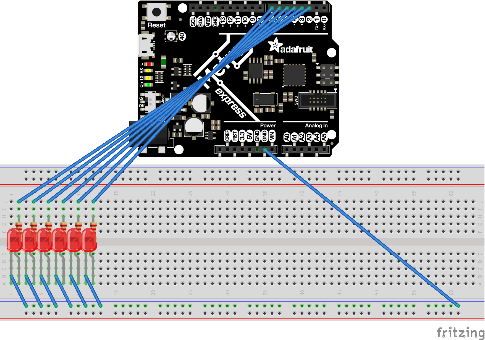

# CircuitPython
My CircuitPython assignments

### LED Fade

##### Objective 
The objective of this assignment was to make the LED fade in and out. 

##### Lessons
We learned how to use CircuitPython/Metro and Mu. 

##### Code 

    '''
    import pulseio
    import board
    import analogio

    #pwm = pulseio.PWMOut(board.D13)     # output on D13
    #pwm.duty_cycle = 2 ** 15            # Cycles the pin with 50% duty cycle (half of 2 ** 16) at the default 500hz

    led = analogio.AnalogOut(board.A0)
    brightness = 40000
    fadeAmount = 10

    import time

    while True:
        led.value = brightness
        brightness = brightness + fadeAmount

    if brightness <= 40000 or brightness >= 65000:

        fadeAmount = -fadeAmount
'''
##### Wiring

### CircuitPython Servo

##### Objective 
The objective of this assignment was to make a servo consistently sweep back and forth between 0 and 180°.

##### Lessons
We learned how to use capacitive touch, an entirely new concept this year. To make the servo move, you had to be touching one of two wires. The direction that the servo went in hinged on which of the wires you were touching (ex. if you touch the left wire, it will move clockwise and if you touch the right wire, it will move counterclockwise). 

##### Code 

    '''
    import time
    import board
    import pulseio
    from adafruit_motor import servo
    import touchio

    touch_pin1 = touchio.TouchIn(board.A4)
    print(touch_pin1.value)
    touch_pin2 = touchio.TouchIn(board.A5)
    print(touch_pin2.value)

    #create a PWMOut object on Pin A2.
    pwm = pulseio.PWMOut(board.A2, duty_cycle=2 ** 15, frequency=50)

    #Create a servo object, my_servo.
    my_servo = servo.Servo(pwm)

    my_servo.angle = 90

    while True:
        if touch_pin1.value:
            #for angle in range(0, 180, 5):  # 0 - 180 degrees, 5 degrees at a time.
            if my_servo.angle >= 2:
                my_servo.angle -= 1
            time.sleep(0.01)

        if touch_pin2.value:
            #for angle in range(180, 0, -5): # 180 - 0 degrees, 5 degrees at a time.
            if my_servo.angle <= 179:
                my_servo.angle += 1
            time.sleep(0.01)
            '''
##### Wiring

### CircuitPython LCD

##### Objective 
The objective of this assignment was to make an LCD show the number of times a button had been pressed. We used a switch to determine whether it would count up or down. 

##### Lessons
We learned how to make an LCD count button presses and use a switch to alter the direction. I personally had trouble making the counter go up/down by ONLY 1. 

##### Code 
    '''
    import time
    import board
    import digitalio

    from lcd.lcd import LCD
    from lcd.i2c_pcf8574_interface import I2CPCF8574Interface

    button_a = digitalio.DigitalInOut(board.D2)
    button_a.direction = digitalio.Direction.INPUT
    button_a.pull = digitalio.Pull.UP

    switch = digitalio.DigitalInOut(board.D8)
    switch.direction = digitalio.Direction.INPUT
    switch.pull = digitalio.Pull.UP

    from lcd.lcd import CursorMode

    lcd = LCD(I2CPCF8574Interface(0x3F), num_rows=4, num_cols=20)

    lcd.clear()

    lcd.set_cursor_pos(0, 0)
    lcd.print("Button Presses:")

    lcd.set_cursor_mode(CursorMode.LINE)
    presses = 0
    lastbutton = True
    while True:

        if not button_a.value and switch.value and lastbutton:
            lcd.set_cursor_pos(1,0)
            presses = presses + 1
            lcd.print(str(presses))
            lcd.print("    ")

        if not button_a.value and not switch.value and lastbutton:
            lcd.set_cursor_pos(1,0)
            presses = presses - 1
            lcd.print(str(presses))
            lcd.print("    ")
        lastbutton = button_a.value
        '''
##### Wiring
        
### Photointerrupter 

##### Objective
The objective of this assignment was to make the Serial Monitor count how many times a photointerrupter has been interrupted. It is to output an updated number every four seconds.

##### Lessons
One of my biggest struggles was making the Serial Monitor print every four seconds without using the sleep function. I ended up learning how to do that with a timer instead of a looped function. 

##### Code 
    '''
    import time
    import board
    import digitalio

    photo = digitalio.DigitalInOut(board.D8)
    photo.direction = digitalio.Direction.INPUT
    photo.pull = digitalio.Pull.UP

    photoCounter = 0
    lastbutton = True
    initial = time.monotonic()

    while True:
            now = time.monotonic()
            if now > initial + 4:
            #if clock is greater than last time + 4
                print("The number of interrupts is:")
                print(photoCounter)
                initial = now
            if photo.value and not lastbutton:
                photoCounter = photoCounter + 1

            lastbutton = photo.value
            '''
##### Wiring

### CircuitPython Distance Sensor

##### Objective 
The objective of this assignment was to coordinate the distance sensor to the onboard LED. 

##### Lessons
In this assignment, we learned how to really work the onboard LED. I had never worked with RGB values before, so that was a valuable experience for later assignments. 

##### Code 
    '''
    import time
    import board
    import adafruit_hcsr04
    import board
    import neopixel
    from simpleio import map_range

    dot = neopixel.NeoPixel(board.NEOPIXEL, 1)

    sonar = adafruit_hcsr04.HCSR04(trigger_pin=board.D5, echo_pin=board.D6)

    while True:
        try:
            distance = sonar.distance
            if distance <= 20:
                r = map_range(distance,0,20,255,0)
                b = map_range(distance,0,20,0,255)
                print(r)
                dot.fill((int(r),0 ,int(b)))

        else:
            b = map_range(distance,20,35,255,0)
            g = map_range(distance,20,35,0,255)
            print(g)
            dot.fill((0,int(g),int(b)))

    except RuntimeError:
        print("Retrying!")
    time.sleep(0.1)
    '''
##### Wiring

### Classes, Objects, and Modules

##### Objective 
The objective of this assignment was to learn how to make classes, objects, and modules. 

##### Lessons
This assignment gave insight into what makes the things we regularly use in our code work; it also introduced vital information for later assignments. I feel that my biggest struggle was the rainbow function because it was a lot less straightforward than  the colors (which were fiarly self explanatory). I also became familiar with RGB LEDs and the required wiring.

##### Code 
'''
    import pulseio
    import simpleio
    import time

    class RGB:
        kind = "color"

        def __init__(self, r, g, b):
            self.r = pulseio.PWMOut(r, duty_cycle=0, frequency=1000)
            self.g = pulseio.PWMOut(g, duty_cycle=0, frequency=1000)
            self.b = pulseio.PWMOut(b, duty_cycle=0, frequency=1000)

        def addTrick(self, trick):
            self.tricks.append(trick)

        def red(self):
            self.r.duty_cycle = 2**16-1
            self.g.duty_cycle = 0
            self.b.duty_cycle = 0

        def green(self):
            self.r.duty_cycle = 0
            self.g.duty_cycle = 2**16-1
            self.b.duty_cycle = 0

        def blue(self):
            self.r.duty_cycle = 0
            self.g.duty_cycle = 0
            self.b.duty_cycle = 2**16-1

        def cyan(self):
            self.r.duty_cycle = 0
            self.g.duty_cycle = 2**16-1
            self.b.duty_cycle = 2**16-1

        def magenta(self):
            self.r.duty_cycle = 2**16-1
            self.g.duty_cycle = 0
            self.b.duty_cycle = 2**16-1

        def yellow(self):
            self.r.duty_cycle = 2**16-1
            self.g.duty_cycle = 2**16-1
            self.b.duty_cycle = 0

        def rainbow1(self):
            rate = 128
            #print("rainbow")
            #self.r.duty_cycle = 0
            #self.b.duty_cycle = 2 ** 16-1
            #self.g.duty_cycle = 2 ** 16-1
            for i in range (0, 2 ** 16, rate):
                self.r.duty_cycle = 0+i
                self.b.duty_cycle = 2 ** 16-1-i
                self.g.duty_cycle = 2 ** 16-1
            for i in range (0, 2 ** 16, rate):
                self.r.duty_cycle = 2 ** 16-1
                self.b.duty_cycle = 0+i
                self.g.duty_cycle = 2 ** 16-1-i
            for i in range (0, 2 ** 16, rate):
                self.r.duty_cycle = 2 ** 16-1-i
                self.b.duty_cycle = 2 ** 16-1
                self.g.duty_cycle = 0+i
        def rainbow2(self):
            rate = 64
            #print("rainbow")
            #self.r.duty_cycle = 0
            #self.b.duty_cycle = 2 ** 16-1
            #self.g.duty_cycle = 2 ** 16-1
            for i in range (0, 2 ** 16, rate):
                self.r.duty_cycle = 0+i
                self.b.duty_cycle = 2 ** 16-1-i
                self.g.duty_cycle = 2 ** 16-1
            for i in range (0, 2 ** 16, rate):
                self.r.duty_cycle = 2 ** 16-1
                self.b.duty_cycle = 0+i
                self.g.duty_cycle = 2 ** 16-1-i
            for i in range (0, 2 ** 16, rate):
                self.r.duty_cycle = 2 ** 16-1-i
                self.b.duty_cycle = 2 ** 16-1
                self.g.duty_cycle = 0+i
    '''
##### Wiring

### Hello VS Code

##### Objective 
The objective of this assignment was to learn how to navigate CircuitPython by having a random message print to the Serial Monitor. 

##### Lessons
This assignment was more introductory than anything else, but it was a really good stepping stone to using the program for complicated assignments. It effectively worked through things that I would have had a lot of questions about later. 

##### Code 
    '''
    import board
    
    While true: 
        print("It works!")
        '''
##### Wiring

### FancyLED

##### Objective 
The objective of this assignment was to use classes, objects, and modules. We were to make a code that had a 6 LEDs go through three functions: sparkle, chase, blink, and alternate. 

##### Lessons
The Classes, Objects, and Modules assignment was extremely helpful here because the setup (if not the code) was very similar. Creating chase, blink, and alternate were fairly simple, but sparkle was a little more complicated. I got some help from Philip and Camden and added some comments on my final code to help future confusion. 

##### Code 
    '''
    import board #pylint: disable-msg=import-error 
    import time #pylint: disable-msg=import-error
    import simpleio #pylint: disable-msg=import-error
    import digitalio #pylint: disable-msg=import-error
    import random #pylint: disable-msg=import-error

    class FancyLED:
        kind = "color"

        def __init__(self, pin1, pin2, pin3):
            self.fancy1 = digitalio.DigitalInOut(pin1)
            self.fancy2 = digitalio.DigitalInOut(pin2)
            self.fancy3 = digitalio.DigitalInOut(pin3)

            self.fancy1.direction = digitalio.Direction.OUTPUT
            self.fancy2.direction = digitalio.Direction.OUTPUT
            self.fancy3.direction = digitalio.Direction.OUTPUT
        
        def alternate(self):
            print("alternate")
            self.fancy1.value = True
            self.fancy2.value = False
            self.fancy3.value = True
            time.sleep(.15)
            self.fancy1.value = False
            self.fancy2.value = True
            self.fancy3.value = False

        def blink(self):
            print("blink")
            self.fancy1.value = False
            self.fancy2.value = False
            self.fancy3.value = False
            time.sleep(.15)
            self.fancy1.value = True
            self.fancy2.value = True
            self.fancy3.value = True

        def chase(self):
            print("chase")
            self.fancy1.value = True
            self.fancy2.value = False
            self.fancy3.value = False
            time.sleep(.1)
            self.fancy1.value = False
            self.fancy2.value = True
            self.fancy3.value = False
            time.sleep(.1)
            self.fancy1.value = False
            self.fancy2.value = False
            self.fancy3.value = True
            time.sleep(.1)

        def sparkle(self):
                print("sparkle")
                rand = random.randrange(4, 10, 1) #randomly selects a pin
                uptime = random.randrange(0, 20, 1)#randomly selects a time
                uptime = uptime/150 #divides time to get a smaller number
            # print(uptime)
            if rand == 4: #run sparkle for each pin with random values
                self.fancy1.value= True
                self.fancy2.value = False
                self.fancy3.value = False
                time.sleep(uptime)
            if rand == 5:
                self.fancy2.value= True
                self.fancy1.value = False
                self.fancy3.value = False
                time.sleep(uptime)
            if rand == 6:
                self.fancy3.value= True
                self.fancy1.value = False
                self.fancy2.value = False
                time.sleep(uptime)
            if rand > 6:
                self.fancy1.value = False
                self.fancy2.value = False
                self.fancy3.value = False
                time.sleep(uptime)
    '''
##### Wiring
    

